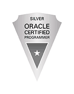

## Wataru

{: width="20%"}

### 職業 / Job

IT Engineer, Software Developer

#### 経験 / Experience

- Java(Spring Frameworkを用いたAPIの開発)
- Dart(Flutterを用いたモバイルアプリ開発)
- Solidity(ブロックチェーン基盤のスマートコントラクト開発)

### 学位 / Degree

修士(博士前期課程) / Master's Degree

- システム情報科学 / System Information Science (March 2021)

### 資格 / Certifications

#### 情報技術 / IT

{: width="15%"}

- 応用情報技術者試験 合格 (October 2022)
- Oracle Certified Java Programmer, Silver SE8 取得 (February 2022)
- 基本情報技術者試験 合格 (October 2018)

#### 金融 / Finance

- 日商簿記検定3級 取得 (April 2021)

#### 語学 / Language

- TOEIC L&R Max Score: 680 (March 2021)

### SNS

#### [Twitter](https://twitter.com/wataruxun)

#### [GitHub](https://github.com/wataruxun)

#### [Qiita](https://qiita.com/wataruxun)
